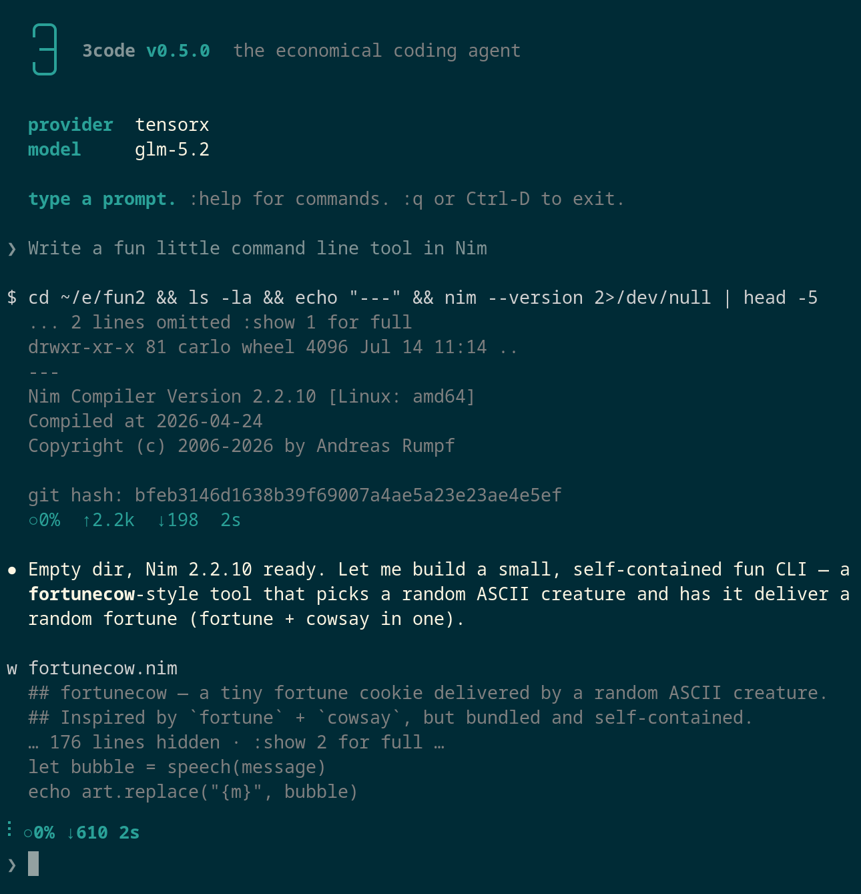

# 3code

**The economical coding agent.**

Get more done with less!

Make your AI plan last longer, lower your token bill, program locally faster. Enjoy yourself more with instant startup and a calm interface.

→ [3code.capocasa.dev](https://3code.capocasa.dev)



---

## Why

A coding agent that works with any OpenAI-compatible endpoint. Bring your own provider! Free-tier and local models work, and subscriptions will last much longer.

## Install

```
# macOS / Linux
curl -fsSL https://3code.capocasa.dev/install | sh

# Windows (PowerShell)
irm https://3code.capocasa.dev/install.ps1 | iex
```

## Quickstart

1. Get an API key from [build.nvidia.com](https://build.nvidia.com). NVIDIA
   Build has a free tier with several known-good coding models, no payment
   required, which makes it the recommended way to try 3code for the first
   time.
2. Run `3code` in a project directory. With no provider configured, the
   setup wizard starts by itself.
3. At the first prompt, enter `nvidia` and paste your key.
4. Pick a model from the list. `glm-5.3-flash` and `deepseek-v4-flash` are solid defaults.
5. Type a prompt:

```
❯ Write a Hello World in Nim and run it
```

That's it. When the free tier runs out, run `:provider add` to stack
another. The [provider guide](https://3code.capocasa.dev/docs#providers-and-authentication)
covers free tiers, flat-rate coding plans, subscription logins, and local
servers.

## Manual

The full documentation is at [3code.capocasa.dev/docs](https://3code.capocasa.dev/docs):
providers, configuration, sandbox policies, sessions, colon commands, and
building from source.

## Library

3code is also a Nim library: the same agent the CLI runs, embeddable in your own program with the terminal replaced by return values and callbacks. Sandbox, tool calls, session persistence, all of it. This is the foundation for building other coding agents or agents of any kind on top of 3code: a web frontend, a chat bot, a CI runner that fixes its own failures, an IDE plugin. The agent loop, tool use, and sandboxing are done; you bring the interface.

The programming manual, with examples and API details, lives in the [docs](https://3code.capocasa.dev/docs).

## License

MIT.
